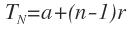
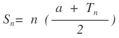
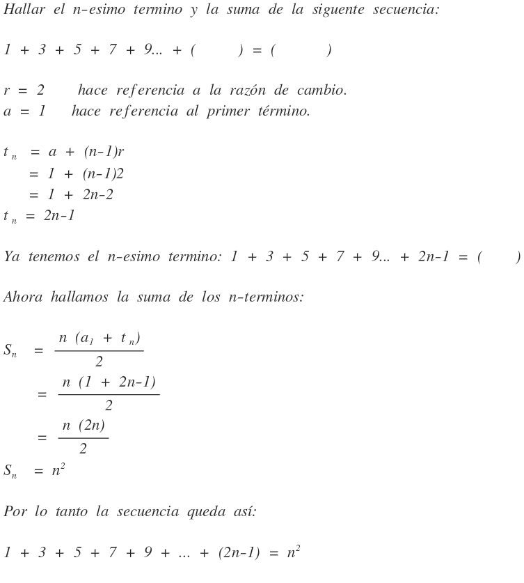
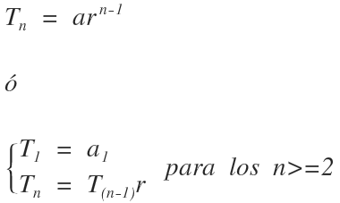
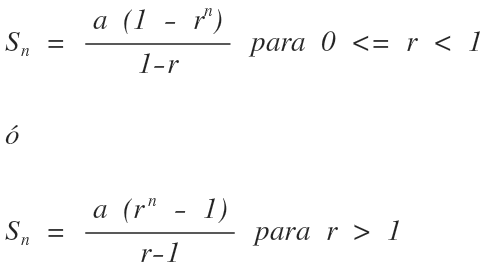
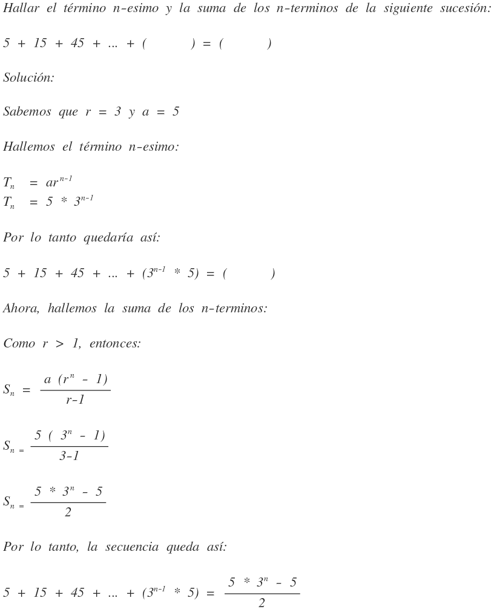
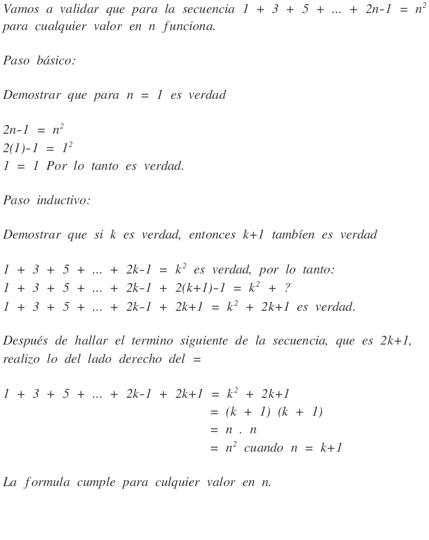

# Matematicas discretas

Las matemáticas discretas son un área de las matemáticas encargadas del estudio de los conjuntos discretos: finitos o infinitos numerables. En oposición a las matemáticas continuas, que se encargan del estudio de conceptos como la continuidad y el cambio continuo, la matemáticas discretas estudian estructuras cuyos elementos pueden contarse uno por uno separadamente. Sirven para resolver problemas analíticos, incluyendo teoría básica de conjuntos, combinatoria, relaciones y funciones, propiedades básicas de grafos y sus aplicaciones en la ciencia de la computación.

## Tabla de contenido

- [Progresión aritmética](#progresion-aritmetica)
- [Progresión geométrica](#progresion-geometrica)
- [Principio de inducción matemática (PIM)](#principio-de-induccion-matematica-pim)
- Relaciones recursivas de una semilla
- Relaciones recursivas de dos semillas
- Conjuntos
    - Conjuntos contables o enumerables
    - Conjunto finito
    - Conjunto infinito
    - Conjunto universo
  - Operaciones entre conjuntos
    - Unión
    - Intercepción
    - Diferencia o resta
    - Diferencia simétrica
    - Complemento
    - Producto cartesiano
  - Partes de un conjunto o conjunto potencia
  - Partición de conjuntos
- Conteo
  - Principio de la multiplicación
  - Principio de adición
  - Combinación
  - Combinación con repetición
  - Permutación
  - Permutación con repetición (objetos indistinguibles)
  - Permutación sin repetición
  - Principio de inclusión y exclusión
- Relaciones
  - Propiedades
    - Reflexiva
    - Simetrica
    - Transitiva
  - Clasificación
    - Uno a uno
    - Uno a muchos
    - Muchos a uno
    - Muchos a muchos
  - Relaciones de equivalencia
  - Cerradura
- Funciones
  - Dominio, codominio y rango
  - Función inyectiva
  - Función sobreyectiva
  - Función biyectiva
  - Función compuesta
  - Función inversa
- Grafos
  - Grafo no dirigido
  - Grafo dirigido
  - Terminología de grafos
  - Representación de un grafo en una matriz de adyacencia
  - Representación de un grafo en una lista de adyacencia
  - Arboles
- [Referencias](#referencias)

## Progresion aritmetica

Es una sucesión de números tales que la diferencia de dos términos sucesivos cualesquiera de la secuencia es una constante, cantidad llamada diferencia de la progresión o razón de cambio. Por ejemplo, la sucesión matemática: 3, 5, 7, 9, 11,... es una progresión aritmética de constante o razón de cambio de 2. Así como: 5, 2, -1, -4 es una progresión aritmética de constante "-3".

**Hallar el término n-esimo de una progresión aritmética**

Formula:



>La formula solo es válida para los n>=1 donde "a" es el primer término de la sucesión, "r" la razón de cambio y "n" es una variable cualquiera que se reemplaza por el número de término que se desea encontrar en la sucesión. 

**Hallar la suma de los n-terminos de la sucesión**

Fórmula:



>Donde "n" es una constante que sirve para reemplazarla por la cantidad de términos que se desea sumar. La letra "a" hace referencia al primer término de la sucesión y "Tn" es el término general o n-ésimo de la sucesión.

Ejemplo:



Computacionalmente y de forma recursiva sería así:

```plain
entero sum;
sum = potencia(n,2);
fin programa;
```

Computacionalmente y de una forma **no tan eficiente** sería un ciclo:

```plain
entero sum = 0;
para (entero i=1; i<=n; i++){
  sum += (2*i-1);
}
fin programa;
```

## Progresion geometrica

Una progresión geométrica es una secuencia en la que el elemento se obtiene multiplicando el elemento anterior por una constante denominada razón o factor de la progresión, ejemplo: 5, 25, 125... la razón de cambio es 5, porque multiplicado por el anterior me da el siguiente término.

**Hallar el término n-esimo**

Formula:



>Donde "a" es el primer término y "r" la razón de cambio.

**Hallar la suma de los n-terminos**

Formula:



Ejemplo:




## Principio de induccion matematica (PIM)

El PIM  se utiliza para validar teoremas o formulas con el objetivo de asegurar que funcionará para cualquier valor en n.

El PIM tiene dos pasos:

**Paso básico**

Es demostrar que para n = 1 es verdad.

**Paso Inductivo**

Vamos a suponer que la formula es valida para k, entonces es verdadera también para k+1

Ejemplo:



>El PIM es importante utilizarlo en las formulas de nuestro código, asegurando que siempre funcionarán para cualquier valor en n.

## Referencias

- [Wikipedia](http://es.wikipedia.org/wiki/Matem%C3%A1ticas_discretas).
- [Universidad Autónoma de Occidente](http://www.uao.edu.co/).


